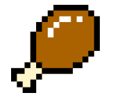

# Food Trivia Game

## This is a trivia game that tests the user's knowledge of food and drink.

[Play the Game Here!](https://mjrobbins18.github.io/SEI-Project1-Food-Trivia/
)
------
## User Stories

As a budding chef, or foodie, or food and beverage aficionado, players are looking for games that test their knowledge on the subjects that they are passionate about. This game helps them to continue to expand their knowledge and learn new and exciting things.

---------


## Gameplay
**The player chooses from easy, medium, and hard difficulty questions.**


**Players can enter their name and are given points or subtracted points based on correct or wrong guesses.**


**Each round is 5 questions long, and number of points for correct guesses are awarded based on the difficulty of the questions. Between each question on the right and wrong screen, a random food joke is generated from an API and printed on screen**


**Questions are generated randomly and do not repeat through rounds.**


**The goal of the game is to complete rounds and get the highest score possible.**


------

# Functionality/Technology Used
 
  **The main functionality in this game comes from the question randomizer:**

 The first part of this code creates an empty array that pushes numbers into it based on the length of the `questionEasy` array. The second part of this code creates a random number based on the length of the `questionEasy` array, and removes it from `questionArray`. The only questions that will be printed are randomly generated, and based on the remaining numbers in `questionArray`. The answers are printed along with the questions.

 ```
 questionArray = [];
const randomQuestion = () => {
if (!questionArray.length) {
    for (let i = 0; i < questionsEasy.length; i ++) {
        questionArray.push(i);
    }
}
let random = Math.floor(Math.random() * questionArray.length);
let val = questionArray[random];
questionArray.splice(random, 1);
question.innerHTML = questionsEasy[val].question;
questionPic.src = questionsEasy[val].image;
for (let i = 0; i < answerButtons.length; i++) {
    answerButtons[i].innerHTML = questionsEasy[val].answer[i]
} 
} 
```


 **The second most important piece in the functionality of this game is in keeping track of right and wrong questions and scoring based on that:**

This code maps through the `questionsEasy` array and compares the correct answers to the `innerHTML` of the `event.target`. If the `isCorrect` variable contains `true`, it will award the player 2 points for guessing the right answer and show the right answer modal. If not, it will deduct 1 point and show the player the wrong answer modal.


 ```
 let isCorrect = questionsEasy.map(item => event.target.innerHTML == item.final)
    if (isCorrect.includes(true)) {
        rMContainer.classList.toggle('show-modal')
        pointsPlus += 2
    } else {
        wMContainer.classList.toggle('show-modal')
        pointsPlus -= 1
    }
```
-----

# Wire Frames

**This was the first idea for the homepage:** 


**Question Modal:** 


**Right/Wrong Modal:**


**Win Screen:**


-----

# Stretch Goals- Major Hurdles/Work in Progress

- Timed gameplay- working on a rapid fire question round with a timer
- Leaderboard- I still haven't fully figured this out and am currently working on it
- Levels
- Added an API that generates random food jokes
- Adding Questions- will be adding more as I continue to update

------

# Resources

I was able to finish this first project with the help of my instructors at General Assembly, as well as:

- [W3C](https://www.w3.org/)
- [Stack Overflow](https://stackoverflow.com/)
- [BLR Deisgn Blog](https://blr.design/blog/multiple-modals/)
- [CSS Tricks](https://css-tricks.com/)
- [Spoonacular Food/Nutrition API- Random Food Joke API](https://rapidapi.com/spoonacular/api/recipe-food-nutrition)

-----